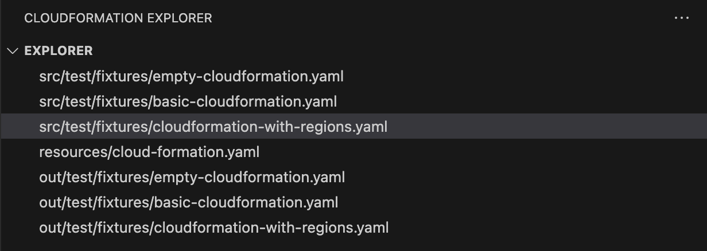
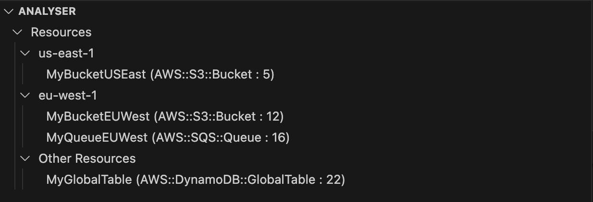

# Cloudformation Explorer README
Simplify your AWS CloudFormation workflow with an easy-to-use resource explorer. Quickly view and navigate your resources grouped by comment regions, making it effortless to understand your cloud infrastructure at a glance.


## Key Features
📂 Automatically group CloudFormation resources into collapsible regions
🔍 Improve template readability and navigation
🚀 Quickly fold and unfold sections of your template
🧭 Clear overview of your template structure
💡 Streamlined CloudFormation development experience


### Cloudformation Navigation
As long as your file begins with `AWSTemplateFormatVersion` it will be included in the explorer

### Cloudformation resoruce grouping
By using the following comment style you can group areas together (similar to C# regions)

```
### region: Nice title ###

... Cloudformation resources

### endregion

```
See the explorer in action!


See how resources can be grouped together easily


## Known Issues

Working on VSCode engine support as we speak!
Adding support for JSON template declarations

## Release Notes
### 0.0.4
Expanding documentation

### 0.0.3
Better readme

### 0.0.2
Extra tests

### 0.0.1
Initial release of cloudformation explorer.

